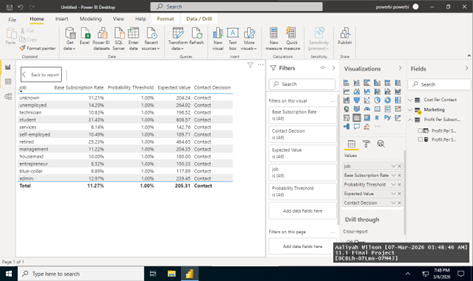
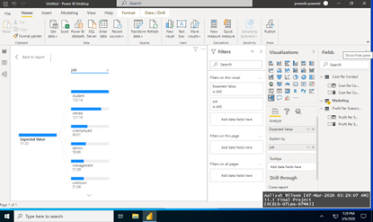
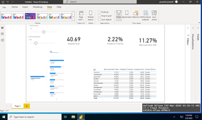
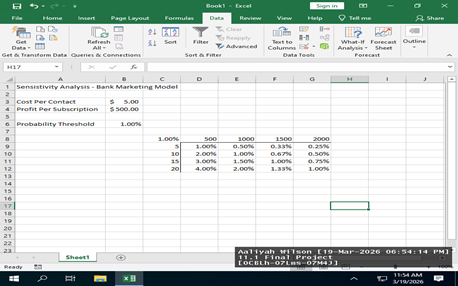

# Aaliyahs-Collection
Data Analytics 
This repository contains analytical projects completed during my MS in Data Analytics at SNHU. Projects focus on financial services data modeling, SQL database design, and decision analysis using PowerBI. 
## Project 1: Decision Analysis Model — Bank Marketing (Power BI)
**Course:** DAT-520 Decision Methods and Modeling

Built an interactive decision model to determine the probability 
threshold at which contacting a customer becomes financially 
beneficial, using a dataset of 41,000+ banking customers.

**Tools:** Power BI, DAX, Excel  
**Skills:** Expected value modeling, sensitivity analysis, 
customer segmentation, data visualization

---

## Project 2: Relational Database & SQL Queries — NexStar Finance
**Course:** DAT-515 Enterprise Data Management

Designed a relational database schema for a financial services 
company and wrote SQL queries to analyze customer and transaction data.

**Tools:** SQL  
**Skills:** Database design, joins, aggregations, fraud monitoring queries

See: nexstar_sql_queries.sql

---

## Project 3: Power BI Process Documentation
Step-by-step documentation of the decision analysis model build 
including DAX measures, parameter setup, and dashboard layout.

See: powerbi_decision_model_documentation.md
